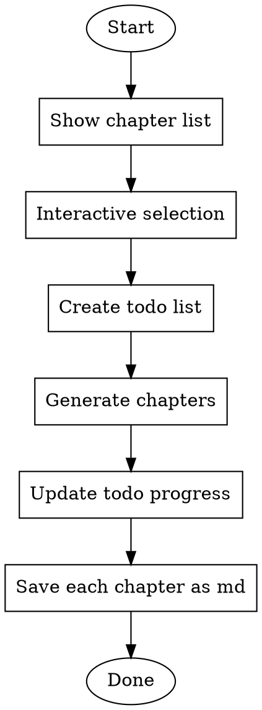

# Generate Manual

为专用项目生成手册，支持交互式章节选择、进度跟踪、分章节输出。

## Overview

本 skill 用于根据预定义的目录结构和内容来源指南，为项目生成完整的手册文档。生成过程中会：
1. 展示一级目录供用户选择
2. 使用交互式界面让用户选择要生成的章节
3. 通过 todo list 实时展示生成进度
4. 每个章节单独保存为一个 md 文件

## When to Use

- 用户要求为项目生成手册/文档
- 需要按章节生成文档内容
- 需要交互式选择生成哪些章节
- 需要跟踪文档生成进度

## Manual Structure (一级目录)

```
01-知识工程概述
├── 1.1 项目简介
├── 1.2 核心特性
└── 1.3 适用场景

02-安装与配置
├── 2.1 环境要求
│   ├── 2.1.1 Python版本
│   ├── 2.1.2 硬件要求
│   └── 2.1.3 核心依赖
├── 2.2 安装步骤
│   ├── 2.2.1 从源码构建
│   └── 2.2.2 基于whl包安装

03-QuickStart
├── 3.1 Hello World
│   ├── 3.1.1 创建YAML配置文件
│   └── 3.1.2 执行Pipeline
└── 3.2 基本使用流程
    ├── 3.2.1 Pipeline执行流程
    ├── 3.2.2 完整YAML示例
    └── 3.2.3 在Python中使用PipelineBuilder执行YAML配置

04-PipelineBuilder使用指南
├── 4.1 PipelineBuilder使用方法
│   ├── 4.1.1 基础用法
│   ├── 4.1.2 核心方法
│   └── 4.1.3 自定义算子路径配置
├── 4.2 YAML配置格式详解
│   ├── 4.2.1 完整配置结构
│   ├── 4.2.2 op_type参数说明
│   └── 4.2.3 depends语法
└── 4.3 算子编排与执行
    ├── 4.3.1 算子类型与处理模式
    ├── 4.3.2 资源配额
    ├── 4.3.3 运行时环境变量
    └── 4.3.4 执行流程图

05-内置算子
├── 5.1 Mapper算子
│   ├── 5.1.1 文本处理算子
│   ├── 5.1.2 音频处理算子
│   ├── 5.1.3 视频处理算子
│   └── 5.1.4 udf算子
├── 5.2 Filter算子
├── 5.3 Duplicator算子
└── 5.4 数据存储与落盘

06-自定义算子的开发和使用
├── 6.1 自定义开发流程
│   ├── 6.1.1 开发步骤
│   └── 6.1.2 算子基类说明
├── 6.2 自定义数据处理算子开发
│   ├── 6.2.1 自定义Mapper算子
│   ├── 6.2.2 自定义FlatMapper算子
│   ├── 6.2.3 自定义GroupMapper算子
│   └── 6.2.4 自定义Filter算子
├── 6.3 自定义DataSource和DataSink
│   ├── 6.3.1 自定义DataSource
│   └── 6.3.2 自定义DataSink
└── 6.4 自定义算子的使用
    ├── 6.4.1 配置自定义算子路径
    └── 6.4.2 注意事项
```

## Content Sources (内容来源指南)

### 01-知识工程概述
| 章节 | 内容来源 |
|------|----------|
| 1.1 项目简介 | 基于对项目的整体了解总结 |
| 1.2 核心特性 | 基于对项目的整体了解总结 |
| 1.3 适用场景 | 基于对项目的整体了解总结 |

### 02-安装与配置
| 章节 | 内容来源 |
|------|----------|
| 2.1.1 Python版本 | 要求Python3.11，推荐Python3.11.4 |
| 2.1.2 硬件要求 | CPU X86-64, arm64, NPU(可选): Ascend 910B系列 |
| 2.1.3 核心依赖 | 阅读 `pyproject.toml` 文件总结 |
| 2.2.1 从源码构建 | 项目构建文档 |
| 2.2.2 基于whl包安装 | 项目安装文档 |

### 03-QuickStart
| 章节 | 内容来源 |
|------|----------|
| 3.1 Hello World | 阅读 `tests/` 目录下的yaml示例和代码 |
| 3.1.1 创建YAML配置文件 | 阅读 `tests/` 目录下的yaml示例 |
| 3.1.2 执行Pipeline | 阅读 `tests/` 目录下的yaml示例和代码 |
| 3.2 基本使用流程 | 阅读 `tests/` 目录下的yaml示例和代码 |

### 04-PipelineBuilder使用指南
| 章节 | 内容来源 |
|------|----------|
| 4.1 PipelineBuilder使用方法 | 阅读 `PipelineBuilder` 源码和 `tests/` 目录yaml示例 |
| 4.2 YAML配置格式详解 | 阅读 `PipelineBuilder` 源码和 `tests/` 目录yaml示例 |
| 4.3 算子编排与执行 | 阅读 `PipelineBuilder` 源码和 `tests/` 目录yaml示例 |

### 05-内置算子
| 章节 | 内容来源 |
|------|----------|
| 5.1 Mapper算子 | 阅读 `src/knowledge_operators/ops/mappers/` 目录，只写已注册的实现类 |
| 5.2 Filter算子 | 阅读 `src/knowledge_operators/ops/filter/` 目录，只写已注册的算子 |
| 5.3 Duplicator算子 | 阅读 `src/knowledge_operators/ops/duplicator/` 目录，只写已注册的算子 |
| 5.4 数据存储与落盘 | 阅读 `src/knowledge_operators/ops/connector/` 目录，按数据源类型分类 |

**重要:** 撰写本章节时不要使用 `functions/` 目录下的内容。

### 06-自定义算子的开发和使用
| 章节 | 内容来源 |
|------|----------|
| 6.1 自定义开发流程 | 阅读 `src/knowledge_operators/ops/base_op.py` 和 `tests/` 目录示例 |
| 6.2 自定义数据处理算子开发 | 阅读 `tests/` 目录下的自定义算子示例 |
| 6.3 自定义DataSource和DataSink | 阅读 `tests/` 目录下的示例 |
| 6.4 自定义算子的使用 | 阅读 `tests/` 目录下的custom算子使用示例 |

## Workflow



## Implementation Steps

### Step 1: 展示一级目录并交互选择

使用 `question` 工具展示以下选项供用户选择：

```
01-知识工程概述
02-安装与配置
03-QuickStart
04-PipelineBuilder使用指南
05-内置算子
06-自定义算子的开发和使用
```

允许用户多选，并提供"全选"选项。

### Step 2: 创建 Todo List

根据用户选择的章节，使用 `todowrite` 工具创建任务列表。每个选中的主章节作为一个任务项。

格式示例：
```json
[
  {"content": "生成 01-知识工程概述", "status": "pending", "priority": "high"},
  {"content": "生成 02-安装与配置", "status": "pending", "priority": "high"},
  ...
]
```

### Step 3: 按章节生成内容

对于每个选中的章节：

1. **更新 todo 状态为 in_progress**
2. **阅读相关源文件**（根据内容来源指南）
3. **生成该章节的所有子章节内容**
4. **保存为独立的 md 文件**（如 `01-知识工程概述.md`）
5. **更新 todo 状态为 completed**
6. **继续下一个章节**

### Step 4: 文件输出规范

- 每个主章节输出为一个独立的 md 文件
- 文件命名格式：`{章节编号}-{章节名称}.md`（如 `01-知识工程概述.md`）
- 文件保存位置：当前工作目录下的 `docs/` 目录
- 文件内部保持完整的章节层级结构

## File Output Example

`01-知识工程概述.md`:
```markdown
# 01-知识工程概述

## 1.1 项目简介
[内容...]

## 1.2 核心特性
[内容...]

## 1.3 适用场景
[内容...]
```

## Common Mistakes

- 跳过交互式选择，直接生成所有章节
- 忘记更新 todo 进度状态
- 将所有章节写入同一个文件
- 忽略内容来源指南，凭空捏造内容
- 撰写内置算子章节时使用了 `functions/` 目录的内容

## Checklist

- [ ] 展示一级目录列表
- [ ] 使用 question 工具进行交互式选择
- [ ] 根据选择创建 todo list
- [ ] 按顺序生成每个章节
- [ ] 每个章节生成前更新 todo 为 in_progress
- [ ] 每个章节生成后更新 todo 为 completed
- [ ] 每个章节保存为独立的 md 文件
- [ ] 内容来源于指定的文件或目录