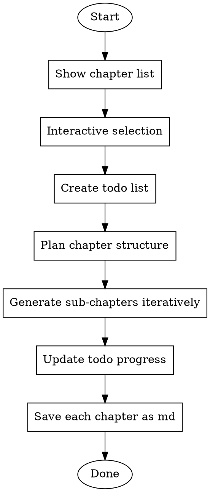

# Generate Manual

为专业数据处理框架生成高质量用户手册，采用专业、高大上的技术文档风格。

## Overview

本 skill 用于为数据处理框架项目生成完整的用户手册。参考 Data-Juicer 等顶级开源项目的文档风格，强调：
- 专业性：使用精确的技术术语和行业最佳实践描述
- 吸引力：突出项目的核心价值和创新特性
- 完整性：覆盖从入门到进阶的完整使用路径
- 可操作性：提供清晰的使用示例和代码片段

## When to Use

- 用户要求为数据处理框架项目生成专业手册/文档
- 需要按章节生成文档内容
- 需要交互式选择生成哪些章节
- 需要跟踪文档生成进度

## Manual Structure (一级目录)

```
01-知识工程概述
├── 1.1 项目简介
├── 1.2 核心特性
└── 1.3 适用场景

02-安装与配置
├── 2.1 环境要求
│   ├── 2.1.1 Python版本
│   ├── 2.1.2 硬件要求
│   └── 2.1.3 核心依赖
├── 2.2 安装步骤
│   ├── 2.2.1 从源码构建
│   └── 2.2.2 基于whl包安装

03-QuickStart
├── 3.1 Hello World
│   ├── 3.1.1 创建YAML配置文件
│   └── 3.1.2 执行Pipeline
└── 3.2 基本使用流程
    ├── 3.2.1 Pipeline执行流程
    ├── 3.2.2 完整YAML示例
    └── 3.2.3 在Python中使用PipelineBuilder执行YAML配置

04-PipelineBuilder使用指南
├── 4.1 PipelineBuilder使用方法
│   ├── 4.1.1 基础用法
│   ├── 4.1.2 核心方法
│   └── 4.1.3 自定义算子路径配置
├── 4.2 YAML配置格式详解
│   ├── 4.2.1 完整配置结构
│   ├── 4.2.2 op_type参数说明
│   └── 4.2.3 depends语法
└── 4.3 算子编排与执行
    ├── 4.3.1 算子类型与处理模式
    ├── 4.3.2 资源配额
    ├── 4.3.3 运行时环境变量

05-内置算子
├── 5.1 Mapper算子
│   ├── 5.1.1 文本处理算子
│   ├── 5.1.2 音频处理算子
│   ├── 5.1.3 视频处理算子
│   └── 5.1.4 udf算子
├── 5.2 Filter算子
├── 5.3 Duplicator算子
└── 5.4 数据存储与落盘

06-自定义算子的开发和使用
├── 6.1 自定义开发流程
│   ├── 6.1.1 开发步骤
│   └── 6.1.2 算子基类说明
├── 6.2 自定义数据处理算子开发
│   ├── 6.2.1 自定义Mapper算子
│   ├── 6.2.2 自定义FlatMapper算子
│   ├── 6.2.3 自定义GroupMapper算子
│   └── 6.2.4 自定义Filter算子
├── 6.3 自定义DataSource和DataSink
│   ├── 6.3.1 自定义DataSource
│   └── 6.3.2 自定义DataSink
└── 6.4 自定义算子的使用
    ├── 6.4.1 配置自定义算子路径
    └── 6.4.2 注意事项
```

## Content Sources (内容来源指南)

### 01-知识工程概述
| 章节 | 内容来源 |
|------|----------|
| 1.1 项目简介 | 基于对项目的整体了解总结 |
| 1.2 核心特性 | 基于对项目的整体了解总结 |
| 1.3 适用场景 | 基于对项目的整体了解总结 |

### 02-安装与配置
| 章节 | 内容来源 |
|------|----------|
| 2.1.1 Python版本 | 要求Python3.11，推荐Python3.11.4 |
| 2.1.2 hardware要求 | CPU X86-64, arm64, NPU(可选): Ascend 910B系列 |
| 2.1.3 核心依赖 | 阅读 `pyproject.toml` 文件总结 |
| 2.2.1 从源码构建 | 项目构建文档 |
| 2.2.2 基于whl包安装 | 项目安装文档 |

### 03-QuickStart
| 章节 | 内容来源 |
|------|----------|
| 3.1 Hello World | 阅读 `tests/` 目录下的yaml示例和代码 |
| 3.1.1 创建YAML配置文件 | 阅读 `tests/` 目录下的yaml示例 |
| 3.1.2 执行Pipeline | 阅读 `tests/` 目录下的yaml示例和代码 |
| 3.2 基本使用流程 | 阅读 `tests/` 目录下的yaml示例和代码 |

### 04-PipelineBuilder使用指南
| 章节 | 内容来源 |
|------|----------|
| 4.1 PipelineBuilder使用方法 | 阅读 `PipelineBuilder` 源码和 `tests/` 目录yaml示例 |
| 4.2 YAML配置格式详解 | 阅读 `PipelineBuilder` 源码和 `tests/` 目录yaml示例 |
| 4.3 算子编排与执行 | 阅读 `PipelineBuilder` 源码和 `tests/` 目录yaml示例 |

### 05-内置算子
| 章节 | 内容来源 |
|------|----------|
| 5.1 Mapper算子 | 阅读 `src/knowledge_operators/ops/mappers/` 目录，只写已注册的实现类 |
| 5.2 Filter算子 | 阅读 `src/knowledge_operators/ops/filter/` 目录，只写已注册的算子 |
| 5.3 Duplicator算子 | 阅读 `src/knowledge_operators/ops/duplicator/` 目录，只写已注册的算子 |
| 5.4 数据存储与落盘 | 阅读 `src/knowledge_operators/ops/connector/` 目录，按数据源类型分类 |

**重要:** 撰写本章节时不要使用 `functions/` 目录下的内容。

### 06-自定义算子的开发和使用
| 章节 | 内容来源 |
|------|----------|
| 6.1 自定义开发流程 | 阅读 `src/knowledge_operators/ops/base_op.py` 和 `tests/` 目录示例 |
| 6.2 自定义数据处理算子开发 | 阅读 `tests/` 目录下的自定义算子示例 |
| 6.3 自定义DataSource和DataSink | 阅读 `tests/` 目录下的示例 |
| 6.4 自定义算子的使用 | 阅读 `tests/` 目录下的custom算子使用示例 |

## Documentation Style Requirements (文档风格要求)

### 总体风格

参考顶级开源项目（如 Data-Juicer、HuggingFace Transformers）的文档风格：

1. **专业性**
   - 使用精确的技术术语（如"数据编排"、"算子融合"、"流水线执行引擎"）
   - 引用行业标准概念（如"云原生"、"AI就绪"、"生产级性能"）
   - 强调架构设计优势（如"模块化"、"可扩展"、"高吞吐"）

2. **吸引力**
   - 开篇即突出项目价值（参考 Data-Juicer: "将原始数据转化为 AI 就绪的智能"）
   - 使用强调性语言（如"无缝扩展"、"零配置"、"生产就绪"）
   - 展示性能数据和应用规模（如"处理 XX 亿样本"、"支持 XX 种数据格式"）

3. **完整性**
   - 提供完整的使用路径（从入门到进阶）
   - 包含实际的代码示例和配置片段
   - 覆盖常见使用场景和最佳实践

4. **可操作性**
   - 每个操作步骤都有清晰的代码示例
   - 配置参数有详细的说明和示例值
   - 提供可直接运行的完整示例

### 禁止的语言风格

- ❌ 贫乏直白："这个项目可以做数据处理"
- ❌ 简短描述："是一个数据框架"
- ❌ 平铺直叙："支持多种算子"
- ❌ 缺乏吸引力："用于处理数据"

### 推荐的语言风格

- ✅ 专业高大上："面向大规模数据处理的云原生编排框架"
- ✅ 强调价值："无缝衔接数据生产与AI模型训练，释放数据潜在价值"
- ✅ 展示特性："提供 XX+ 种可组合算子，支持从单机到千节点集群的弹性扩展"
- ✅ 突出优势："生产级性能：在 XX 节点上 X 小时处理 XX 亿样本"

## Workflow



## Implementation Steps

### Step 1: 展示一级目录并交互选择

使用 `question` 工具展示以下选项供用户选择：

```
01-知识工程概述
02-安装与配置
03-QuickStart
04-PipelineBuilder使用指南
05-内置算子
06-自定义算子的开发和使用
```

允许用户多选，并提供"全选"选项。

### Step 2: 创建 Todo List

根据用户选择的章节，使用 `todowrite` 工具创建任务列表。每个选中的主章节作为一个任务项。

格式示例：
```json
[
  {"content": "生成 01-知识工程概述", "status": "pending", "priority": "high"},
  {"content": "生成 02-安装与配置", "status": "pending", "priority": "high"},
  ...
]
```

### Step 3: 规划章节拆分策略

**重要约束：不要一次性生成整个章节！**

在生成每个主章节之前，必须先思考并规划：
1. 该章节包含哪些子章节
2. 每个子章节的生成顺序
3. 每次生成的内容量限制（避免一次性生成过多内容）
4. 如何将内容追加到已有的 .md 文件中

**拆分原则：**
- 对于简单的章节（如 01-知识工程概述），可以一次生成
- 对于复杂章节（如 05-内置算子），必须拆分成多个步骤：
  - 第一步：生成章节框架和简介
  - 第二步：逐个子章节生成详细内容
  - 第三步：生成表格和示例代码
  - 第四步：完善引用和补充说明

**示例：05-内置算子章节的拆分策略**

```
拆分计划：
1. 第一次生成：章节标题 + 总体介绍 + 算子分类概览表格
2. 第二次生成：5.1 Mapper算子 - 文本处理算子详细说明
3. 第三次生成：5.1 Mapper算子 - 音频/视频/udf算子详细说明
4. 第四次生成：5.2 Filter算子详细说明
5. 第五次生成：5.3 Duplicator算子 + 5.4 数据存储与落盘
```

### Step 4: 分步骤生成内容并追加到文件

**关键要求：使用追加模式，不要一次性生成整个章节！**

对于每个主章节：

1. **创建章节文件框架**
   - 创建空的 .md 文件
   - 写入章节标题和总体介绍
   
2. **逐个子章节生成并追加**
   - 每次生成 1-2 个子章节
   - 使用追加模式写入文件（不要覆盖已有内容）
   - 确保每次生成的内容都有完整的小节标题和内容
   
3. **更新 todo 进度**
   - 每完成一个子章节块，更新 todo 进度
   - 可以在 todo 中细分到子章节级别
   
4. **完善和补充**
   - 最后补充示例代码、引用链接等
   - 检查内容的完整性和连贯性

### Step 5: 文件输出规范

- 每个主章节输出为一个独立的 md 文件
- 文件命名格式：`{章节编号}-{章节名称}.md`（如 `01-知识工程概述.md`）
- 文件保存位置：当前工作目录下的 `docs/` 目录
- 使用追加模式写入文件，避免覆盖已有内容
- 文件内部保持完整的章节层级结构

**追加写入示例：**

```python
# 第一次：创建文件并写入框架
with open('docs/05-内置算子.md', 'w') as f:
    f.write('# 05-内置算子\n\n')
    f.write('## 概述\n\n[总体介绍内容]\n\n')

# 第二次：追加 Mapper 算子介绍
with open('docs/05-内置算子.md', 'a') as f:
    f.write('## 5.1 Mapper算子\n\n')
    f.write('### 5.1.1 文本处理算子\n\n[详细内容]\n\n')

# 第三次：追加更多算子类型
with open('docs/05-内置算子.md', 'a') as f:
    f.write('### 5.1.2 音频处理算子\n\n[详细内容]\n\n')
```

## File Output Example

### 示例1：简单的章节（01-知识工程概述）

`01-知识工程概述.md`（可一次性生成）：
```markdown
# 01-知识工程概述

## 1.1 项目简介

本项目是一个面向大规模数据处理的云原生编排框架，旨在无缝衔接数据生产与AI模型训练，释放每份数据的潜在价值。通过提供模块化的算子构建块，在整个AI生命周期中清洗、合成和分析数据，支持从单机到千节点集群的弹性扩展——无需编写胶水代码。

## 1.2 核心特性

### 模块化与可扩展架构
- **XX+ 种可组合算子** 涵盖文本、图像、音频、视频和多模态数据处理
- **配方优先**：可复现的YAML管道，支持版本管理、共享和分叉
- **可组合**：可插入单个算子、链接复杂工作流或编排完整管道

### 生产级性能
- **弹性扩展**：从笔记本电脑无缝扩展到数千节点的集群
- **高吞吐**：生产级性能验证，支持大规模数据处理
- **可观测性**：内置追踪功能，用于调试、审计和迭代改进

## 1.3 适用场景

### 基础模型数据处理
- 预训练语料库去重和清洗
- 微调数据质量把关
- 强化学习数据整理

### 多模态数据准备
- 视频数据预处理和标注
- 图像数据清洗和增强
- 音频数据格式转换和质量过滤

### RAG与分析
- 文档提取和规范化
- 语义分块和去重
- 数据画像分析
```

### 示例2：复杂的章节（05-内置算子）需要分多次生成

**第一次生成：创建框架和概述**

`05-内置算子.md`（第一次）：
```markdown
# 05-内置算子

## 概述

算子（Operator）是数据处理流水线的基本构建块，负责对数据样本执行修改、清理、过滤、去重等操作。本项目提供丰富多样的内置算子，覆盖文本、图像、音频、视频等多模态数据处理场景，支持灵活组合以构建复杂的数据处理流水线。

## 算子分类总览

本项目内置算子分为以下几类：

| 算子类型 | 数量 | 描述 | 主要用途 |
|---------|------|------|---------|
| Mapper | XX+ | 数据转换算子 | 编辑、转换、增强数据样本 |
| Filter | XX+ | 数据过滤算子 | 过滤低质量样本 |
| Duplicator | XX+ | 去重算子 | 识别、删除重复样本 |
| DataSource | XX | 数据源算子 | 加载、读取各类数据源 |
| DataSink | XX | 数据落盘算子 | 写入、导出各类数据格式 |
```

**第二次生成：追加 Mapper 算子详细说明**

`05-内置算子.md`（追加内容）：
```markdown
## 5.1 Mapper算子

Mapper算子用于对数据样本进行编辑和转换，支持单样本处理和批量处理两种模式。

### 5.1.1 文本处理算子

| 算子名称 | 标签 | 描述 | 详情 |
|---------|------|------|------|
| text_add_column_mapper | 📝文本 💻CPU | 为数据样本添加新列 | [详情](#text_add_column_mapper) |
| text_clean_mapper | 📝文本 💻CPU | 清理文本中的噪音字符 | [详情](#text_clean_mapper) |

#### text_add_column_mapper

**功能说明**
为数据样本添加新的列字段，支持固定值和动态计算值。

**参数说明**
- `column_name`: str - 新列的名称
- `value`: Any - 新列的值，可以是固定值或计算表达式

**使用示例**
```yaml
process:
  - op_name: "text_add_column_mapper"
    op_type: "operator"
    params:
      args:
        column_name: "category"
        value: "AI"
```
```

## Special Requirements for Different Chapters

### 01-知识工程概述章节要求

**必须包含：**
- 高大上的项目定位描述（参考 Data-Juicer 首页风格）
- 使用徽章展示项目特性（如：`[]`）
- 突出核心优势的列表（如：模块化、可扩展、生产级）
- 具体的性能数据和应用规模（如果有）
- 明确的适用场景分类

**参考风格：**
```markdown
本项目是面向大规模数据处理的云原生编排框架，将原始数据转化为AI就绪的智能。它将数据处理视为可组合的基础设施——提供模块化构建块，在整个AI生命周期中清洗、合成和分析数据，释放每份数据的潜在价值。

无论您是在去重网络规模的预训练语料库、整理智能体交互轨迹，还是准备特定领域的RAG索引，本框架都可以从您的笔记本电脑无缝扩展到数千节点的集群——无需编写胶水代码。
```

### 05-内置算子章节要求

**必须包含：**
- 算子分类总览表格（参考 Data-Juicer Operators 页面）
- 每个算子的详细信息表格，包含：
  - 算子名称
  - 标签（模态标签：📝文本/🏞图像/📣音频/🎬视频，资源标签：💻CPU/🚀GPU）
  - 功能描述
  - 参数说明
  - 使用示例（YAML配置）
  
**表格格式示例：**

```markdown
| 算子名称 | 标签 | 功能描述 | 详情链接 |
|---------|------|---------|---------|
| text_add_column_mapper | 📝文本 💻CPU | 为数据样本添加新列字段 | [详情](#text_add_column_mapper) |
| audio_duration_filter | 📣音频 💻CPU | 过滤音频时长不在指定范围的样本 | [详情](#audio_duration_filter) |
```

**算子详细说明格式：**

```markdown
#### text_add_column_mapper

**功能说明**
[详细的算子功能描述，说明算子的作用和应用场景]

**参数说明**
- `param1`: type - 参数描述
- `param2`: type - 参数描述

**使用示例**
```yaml
process:
  - op_name: "text_add_column_mapper"
    op_type: "operator"
    params:
      args:
        column_name: "category"
        value: "AI"
```

**注意事项**
[使用该算子需要注意的要点]
```

**分步骤生成策略：**
- 第一次：生成章节框架 + 算子分类总览表格
- 第二次：生成 Mapper 算子列表表格 + 1-2个算子详细说明
- 第三次：追加更多 Mapper 算子详细说明
- 第四次：生成 Filter 算子内容
- 第五次：生成 Duplicator 和数据存储算子内容

## Common Mistakes

- ❌ 跳过交互式选择，直接生成所有章节
- ❌ 忘记更新 todo 进度状态
- ❌ 将所有章节写入同一个文件
- ❌ 忽略内容来源指南，凭空捏造内容
- ❌ 撰写内置算子章节时使用了 `functions/` 目录的内容
- ❌ **一次性生成整个章节内容**（必须分步骤生成）
- ❌ **使用覆盖模式而非追加模式写入文件**
- ❌ **语言贫乏直白，缺乏专业性和吸引力**
- ❌ **缺乏表格组织，平铺直叙列出算子**

## Checklist

- [ ] 展示一级目录列表
- [ ] 使用 question 工具进行交互式选择
- [ ] 根据选择创建 todo list
- [ ] 规划章节拆分策略（思考分几次生成）
- [ ] 按顺序生成每个章节
- [ ] 每个章节分多次生成，使用追加模式
- [ ] 每次生成前更新 todo 为 in_progress
- [ ] 每次生成后更新 todo 进度
- [ ] 每个章节保存为独立的 md 文件
- [ ] 内容来源于指定的文件或目录
- [ ] 语言风格专业、高大上
- [ ] 算子章节使用表格组织
- [ ] 包含完整的示例代码和参数说明

## Additional Constraints

### 性能和质量约束

1. **内容真实性**
   - 所有内容必须来源于指定的代码文件和目录
   - 不要凭空捏造算子功能或参数
   - 示例代码必须参考实际的测试文件

2. **内容完整性**
   - 每个算子必须包含功能说明、参数说明、使用示例
   - YAML配置示例必须完整且可运行
   - 参数类型和默认值必须准确

3. **语言专业性**
   - 使用行业标准术语（如"流水线"、"算子"、"编排"）
   - 参考顶级开源项目的表达方式
   - 禁止口语化、贫乏的表达

4. **结构清晰性**
   - 使用表格组织算子列表
   - 使用清晰的层级结构
   - 每个小节都有明确的标题

### 执行约束

1. **分步骤约束**
   - 禁止一次性生成超过 3 个子章节的内容
   - 复杂章节必须拆分成至少 3-5 次生成
   - 每次生成后必须更新 todo 进度

2. **追加约束**
   - 禁止使用覆盖模式（'w'）写入已有内容的文件
   - 必须使用追加模式（'a'）或读取后追加
   - 每次追加内容必须包含完整的小节标题

3. **验证约束**
   - 每次生成后检查文件内容的完整性
   - 确保追加的内容与已有内容连贯
   - 检查示例代码的正确性